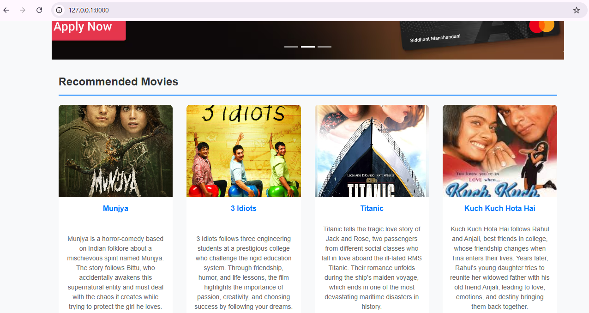
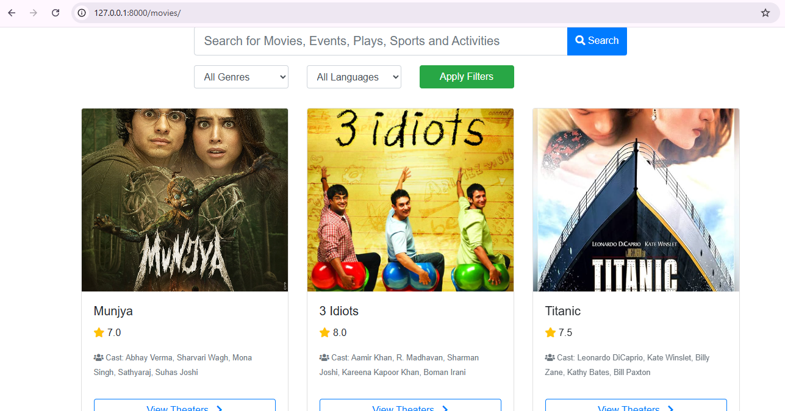

# 🎬 BookMySeat

BookMySeat is a Django-based movie ticket booking web application.
It allows users to:
- View movies
- Select theaters
- Choose seats
- Make online payments using Stripe
- Receive booking confirmation
- Admin dashboard to view revenue and bookings

## 🚀 Features
- Movie listing with search, genre & language filter
- Seat reservation system (with timeout)
- Stripe payment integration
- Email confirmation after booking
- Admin dashboard (Revenue, Popular Movies, Total Bookings)
  
## 🛠 Tech Stack
- Python
- Django
- PostgreSQL (Render)
- Stripe Payment Gateway
- HTML, CSS, Bootstrap
- Render (Backend Hosting)
- Vercel (Frontend Hosting)

## 📸 Screenshots

### Main Page

### Movies Page

### Movie Info Page

### Seat Booking Page

### Stripe Payment Page

### Payment Failed Page

### Payment Received Page

### Admin Dashboard

## 👩‍💻 Developed By

Asiya Charolia  
BSc IT Student  
Internship Project
